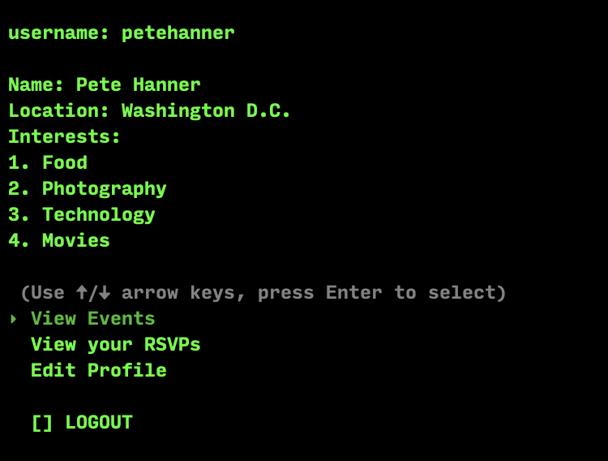
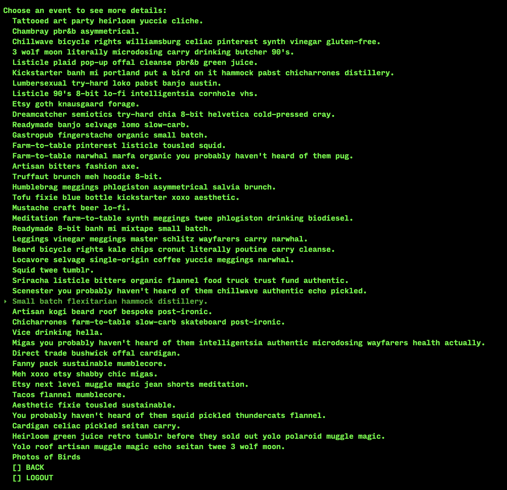
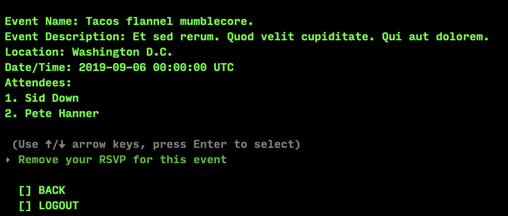

# **FriendUp**
###### *A Rob Paik & Pete Hanner Joint*

****

FriendUp is a (demo) CLI app to find events in your area matching your interests. You can create and save a profile, view events, RSVP to events, and see other users who plan to attend events.

## Install and Run

Clone the repo and navigate to its folder in your terminal. Run `bundle install` to make sure all required gems are present and up to date. Run `rake db:seed` to make sure the app has all its demo data. Finally, run `ruby bin/run.rb` and you're ready to go!

## Login

#### New Users

To create an account, choose a username using only letters, numbers, and underscores. Enter your full name and choose a location. Finally, add some interests to your profile. Use `Space` to select an interest, and press `Enter` when you're done.

#### Returning Users

Enter your username to see your account homepage. (Password features under construction).

## Homepage

#### View Events

See a list of events in your area you may be interested in. Sample event names provided by the Hipster library of the Faker gem. Selecting an event takes you to more details about it, with the option to add or remove an RSVP to it.

#### View your RSVPs

See only events you've added to your RSVPs. Select an event to see more details, with the option to un-RSVP.

#### Edit Profile

You can change your display name and modify your location or interests at any time.
